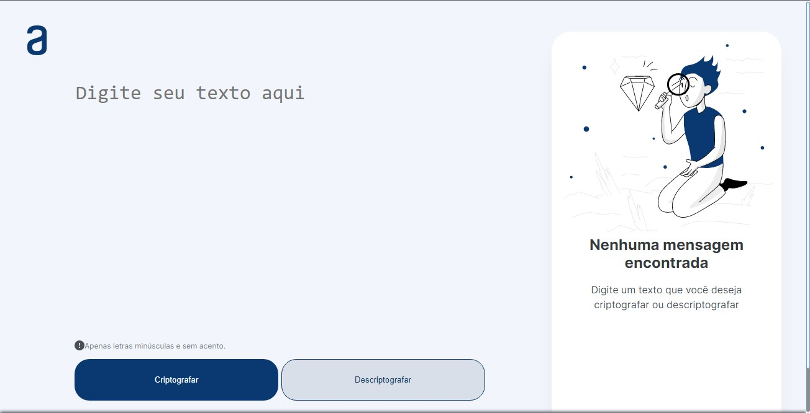
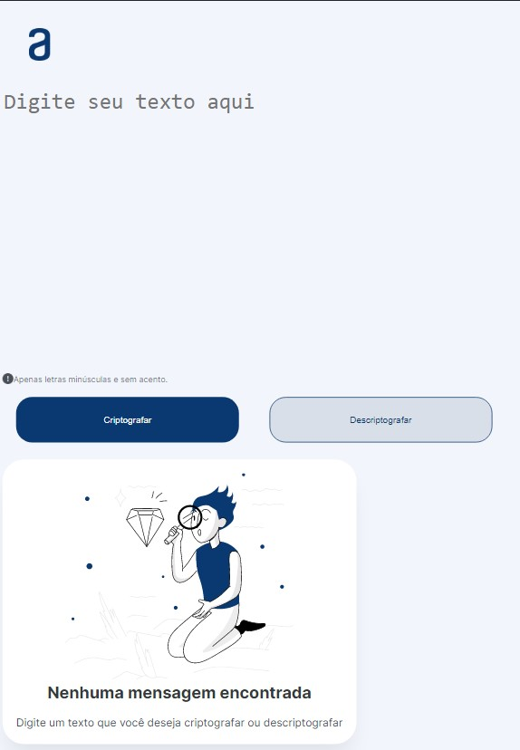
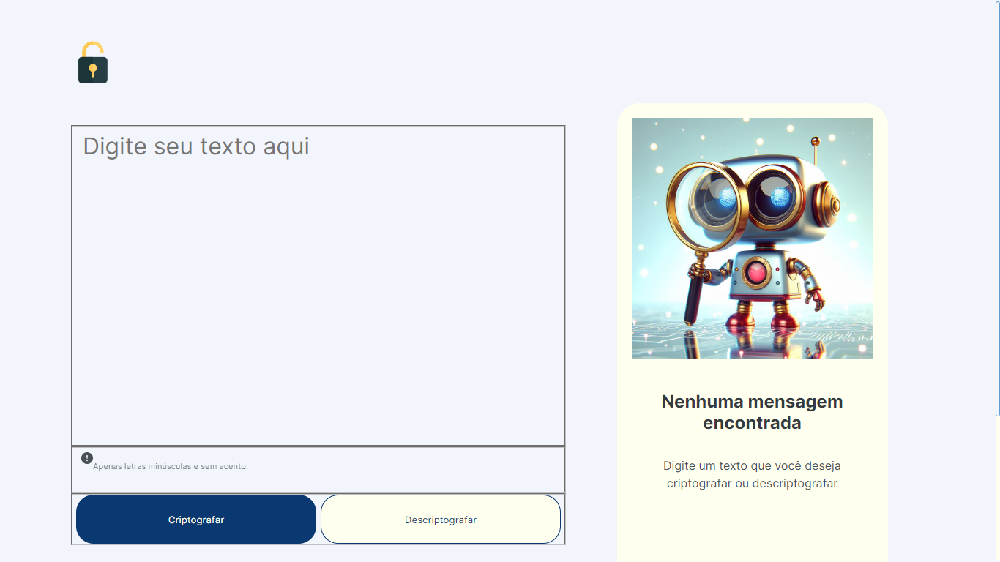
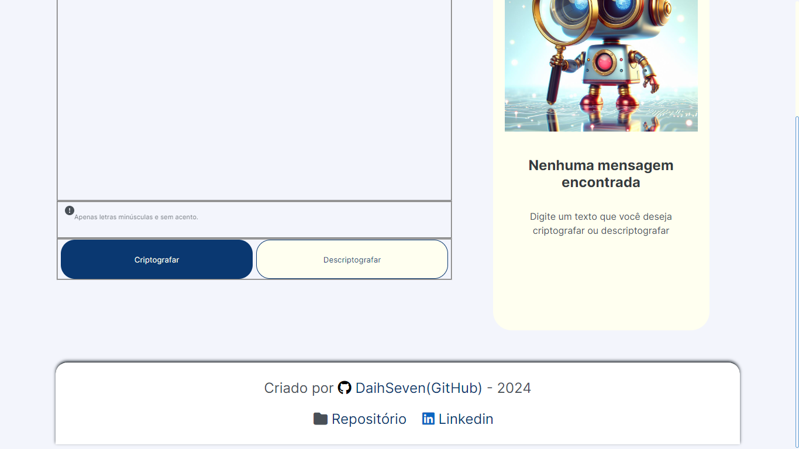
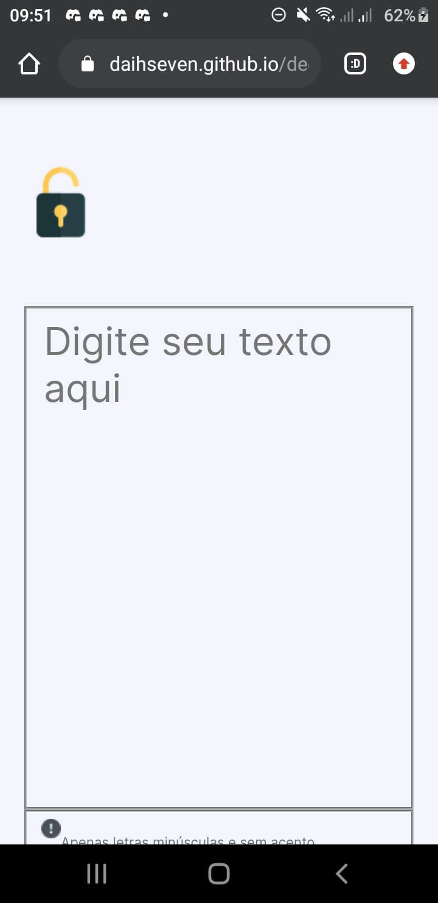
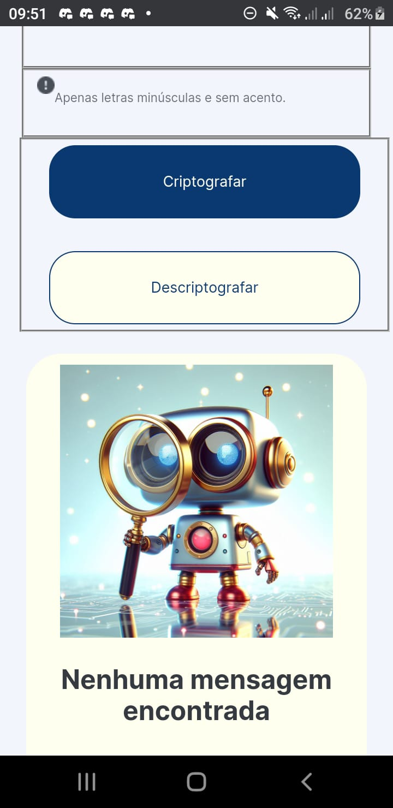
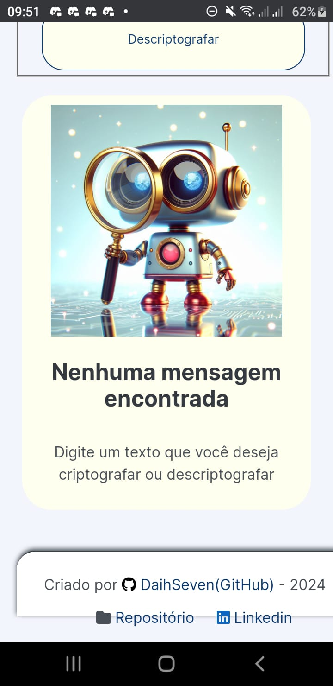

# #challengeonedecodificador5
# 📚 DECODIFICADOR DE TEXTO - Challenge Alura

Nesse projeto o objetivo é criar uma pagina web que criptografe e descriptografe um texto informado pelo usuário.

Para a criptografia foi usado a lista de chaves abaixo 👇 

| Original | Criptografado |
|:--------:|:-------------:|
| a        | cut           |
| e        | abo           |
| i        | sale          |
| o        | mufa          |
| u        | pema          |

Dessa forma a palavra "gato" se torna "gcuttpema" quando criptografada.

##  🚀 Tecnologias Usadas

<br/>
<p align="left">


</p>

### Modelo Figma - Decodificador de Texto - Alura
```bash
https://www.figma.com/file/tvFEYhVfZTjdJ5P24RGV21/Alura-Challenge---Desafio-1---Lógica
```
### SASS - Compilador CSS 
```bash
https://sass-lang.com/
```
### TRELLO - Decodificador de Texto - Alura
```bash
https://trello.com/b/0PDKeemv/challenges-tgf-one
```


## Versão proposta pela ALURA
<h3 align="center">
     <br>
    
</h3>
## Minha versão
<h3 align="center">
     <br>  <br>
     <br>
     <br>
     <br>
    
</h3>


#  🔗 Challenge ONE Sprint 01:
Construa um decodificador de texto com Javascript

```bash
https://www.alura.com.br/challenges/challenge-one-logica/sprint01-construa-decodificador-texto-com-javascript
```

## Aluna
<table align="center">
    <tr>
        <td align="center">
            <a href="https://github.com/DaihSeven">
                
                <br />
                <sub><b>Daiane Das Graças Barbosa Koslowski</b></sub>
            </a>
        </td>
    </tr>
</table>

